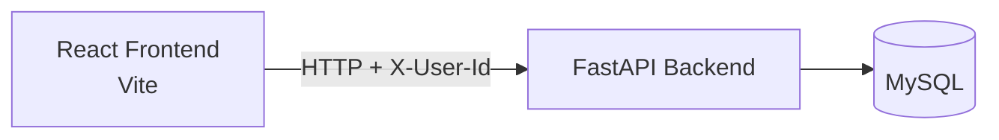

# HabitTracker

A full-stack habit tracking app with clusters, daily logs, and ungrouped habits.

## Overview

- Frontend: React + Vite + Tailwind
- Backend: FastAPI + SQLModel
- Database: MySQL

## Core Features

- Create, edit, and delete habits
- Create, edit, and delete clusters
- Assign habits to clusters or ungrouped (`cluster_id = null`)
- Track and toggle daily completion logs

## Architecture



## File Architecture

```text
habittracker/
├── backend/
│   ├── main.py                # FastAPI app setup + CORS + router mounting
│   ├── config.py              # Environment-based DB/app configuration
│   ├── config.example.py      # Copy this to config.py for local setup
│   ├── database.py            # SQLModel engine + DB session provider
│   ├── dependencies.py        # Shared backend helpers (user/lookup dependencies)
│   ├── models.py              # SQLModel entities + create/update schemas
│   └── routers/
│       ├── habits.py          # Habit CRUD API endpoints
│       ├── habit_logs.py      # Habit log API endpoints
│       └── clusters.py        # Cluster CRUD + cluster-habit API endpoints
├── frontend/
│   ├── src/
│   │   ├── api.js             # Frontend API client wrappers
│   │   ├── App.jsx            # Root React app shell
│   │   └── components/
│   │       ├── HabitContext.jsx                # Shared state + action handlers
│   │       └── habit-page/
│   │           ├── Habits.jsx                 # Main habits page + modal wiring
│   │           ├── HabitCard.jsx              # Habit card UI + actions entry
│   │           ├── DayCell.jsx                # Single day cell in habit calendar grid
│   │           ├── GroupHeader.jsx            # Cluster/section heading row
│   │           ├── MonthNavigation.jsx        # Month switcher controls
│   │           ├── CreateHabitModal.jsx       # Cluster-scoped habit creation modal
│   │           ├── CreateGlobalHabitModal.jsx # Global habit creation modal
│   │           ├── EditHabitModal.jsx         # Habit edit/delete modal
│   │           ├── CreateClusterModal.jsx     # Cluster creation modal
│   │           ├── EditClusterModal.jsx       # Cluster edit/delete modal
│   │           ├── ColorPicker.jsx            # Reusable cluster color picker
│   │           ├── clusterColors.js           # Color options for clusters
│   │           └── themeGradients.js          # Shared gradient constants
│   └── package.json           # Frontend dependencies + npm scripts
├── requirements.txt           # Backend Python dependencies
└── README.md                  # Project docs
```

## Prerequisites

- Node.js 18+
- Python 3.11+
- MySQL

## Quick Start

1. Install frontend deps:

```bash
cd frontend
npm install
```

2. Create Python env and install backend deps:

```bash
cd ..
python3 -m venv .venv
source .venv/bin/activate
pip install -r requirements.txt
```

3. Configure backend DB (simple config-file flow):

```bash
cp backend/config.example.py backend/config.py
```

Then edit `backend/config.py` with your local DB values.

Notes:

- `backend/config.py` is gitignored (safe for local secrets).
- If you prefer, you can still use environment variables (`DATABASE_URL`, `DB_HOST`, etc.).

4. Run backend:

```bash
cd backend
uvicorn main:app --reload
```

5. Run frontend:

```bash
cd ../frontend
npm run dev
```

## Frontend Scripts

From `frontend/`:

- `npm run dev`
- `npm run build`
- `npm run preview`
- `npm run lint`

## API Routes

### Habits

- `GET /habits`
- `POST /habits`
- `GET /habits/{habit_id}`
- `PATCH /habits/{habit_id}`
- `DELETE /habits/{habit_id}`

### Habit Logs

- `GET /habitlogs`
- `POST /habitlogs/{habit_id}`
- `DELETE /habitlogs/{habit_id}?log_date=YYYY-MM-DD`

### Clusters

- `GET /clusters`
- `POST /clusters`
- `GET /clusters/{cluster_id}`
- `PATCH /clusters/{cluster_id}`
- `DELETE /clusters/{cluster_id}`
- `GET /clusters/{cluster_id}/habits`

## MySQL Schema

```sql
USE habit_tracker;

CREATE TABLE users (
	id CHAR(36) PRIMARY KEY,
    created_at DATETIME DEFAULT CURRENT_TIMESTAMP
);

CREATE TABLE clusters (
	id INT AUTO_INCREMENT PRIMARY KEY,
    user_id CHAR(36) NOT NULL,
    name VARCHAR(100) NOT NULL,
    color VARCHAR(7) NOT NULL DEFAULT '#8E8E8E',

	created_at DATETIME DEFAULT CURRENT_TIMESTAMP,
    updated_at DATETIME DEFAULT CURRENT_TIMESTAMP ON UPDATE CURRENT_TIMESTAMP,

    FOREIGN KEY (user_id) REFERENCES users(id) ON DELETE CASCADE
);

CREATE TABLE habits (
	id INT AUTO_INCREMENT PRIMARY KEY,
	user_id CHAR(36) NOT NULL,
    name VARCHAR(100) NOT NULL,

    created_at DATETIME DEFAULT CURRENT_TIMESTAMP,
    updated_at DATETIME DEFAULT CURRENT_TIMESTAMP ON UPDATE CURRENT_TIMESTAMP,

    cluster_id INT NULL,

	FOREIGN KEY (user_id) REFERENCES users(id) ON DELETE CASCADE,
    FOREIGN KEY (cluster_id) REFERENCES clusters(id) ON DELETE SET NULL
);

CREATE TABLE habit_logs (
    log_date DATE NOT NULL,
    habit_id INT NOT NULL,

    PRIMARY KEY (habit_id, log_date),

    FOREIGN KEY (habit_id) REFERENCES habits(id) ON DELETE CASCADE
);
```

## SQL Utility Queries

**To get all users:**

```sql
SELECT * FROM habit_tracker.users;
```

**To get all habits for a user:**

```sql
SELECT * FROM habit_tracker.habits WHERE habit_tracker.habits.user_id = 'USER-ID';
```

**To get all clusters for a user:**

```sql
SELECT * FROM habit_tracker.clusters WHERE habit_tracker.clusters.user_id = 'USER-ID';
```

**To get all habit logs for a user:**

```sql
SELECT * FROM habit_tracker.habit_logs JOIN habit_tracker.habits ON habit_tracker.habit_logs.habit_id = habit_tracker.habits.id WHERE habit_tracker.habits.user_id = 'USER-ID';
```
